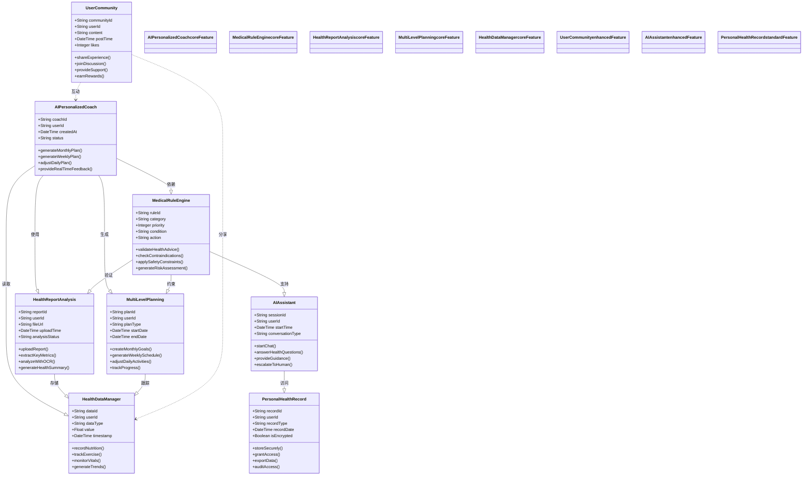

# 系统特性架构关系图

```mermaid
classDiagram
    %% 系统特性类定义
    class AIPersonalizedCoach {
        +String coachId
        +String userId
        +DateTime createdAt
        +String status
        +generateMonthlyPlan()
        +generateWeeklyPlan()
        +adjustDailyPlan()
        +provideRealTimeFeedback()
    }

    class MedicalRuleEngine {
        +String ruleId
        +String category
        +Integer priority
        +String condition
        +String action
        +validateHealthAdvice()
        +checkContraindications()
        +applySafetyConstraints()
        +generateRiskAssessment()
    }

    class HealthReportAnalysis {
        +String reportId
        +String userId
        +String fileUrl
        +DateTime uploadTime
        +String analysisStatus
        +uploadReport()
        +extractKeyMetrics()
        +analyzeWithOCR()
        +generateHealthSummary()
    }

    class MultiLevelPlanning {
        +String planId
        +String userId
        +String planType
        +DateTime startDate
        +DateTime endDate
        +createMonthlyGoals()
        +generateWeeklySchedule()
        +adjustDailyActivities()
        +trackProgress()
    }

    class HealthDataManager {
        +String dataId
        +String userId
        +String dataType
        +Float value
        +DateTime timestamp
        +recordNutrition()
        +trackExercise()
        +monitorVitals()
        +generateTrends()
    }

    class UserCommunity {
        +String communityId
        +String userId
        +String content
        +DateTime postTime
        +Integer likes
        +shareExperience()
        +joinDiscussion()
        +provideSupport()
        +earnRewards()
    }

    class AIAssistant {
        +String sessionId
        +String userId
        +DateTime startTime
        +String conversationType
        +startChat()
        +answerHealthQuestions()
        +provideGuidance()
        +escalateToHuman()
    }

    class PersonalHealthRecord {
        +String recordId
        +String userId
        +String recordType
        +DateTime recordDate
        +Boolean isEncrypted
        +storeSecurely()
        +grantAccess()
        +exportData()
        +auditAccess()
    }

    %% 依赖关系定义
    AIPersonalizedCoach --|> MedicalRuleEngine : 依赖
    AIPersonalizedCoach --|> HealthReportAnalysis : 使用
    AIPersonalizedCoach --|> MultiLevelPlanning : 生成
    AIPersonalizedCoach --|> HealthDataManager : 读取

    MedicalRuleEngine --|> HealthReportAnalysis : 验证
    MedicalRuleEngine --|> MultiLevelPlanning : 约束
    MedicalRuleEngine --|> AIAssistant : 支持

    HealthReportAnalysis --|> HealthDataManager : 存储
    MultiLevelPlanning --|> HealthDataManager : 跟踪
    AIAssistant --|> PersonalHealthRecord : 访问

    UserCommunity ..> AIPersonalizedCoach : 互动
    UserCommunity ..> HealthDataManager : 分享

    %% 类样式定义
    class AIPersonalizedCoach coreFeature
    class MedicalRuleEngine coreFeature
    class HealthReportAnalysis coreFeature
    class MultiLevelPlanning coreFeature
    class HealthDataManager coreFeature
    class UserCommunity enhancedFeature
    class AIAssistant enhancedFeature
    class PersonalHealthRecord standardFeature

    %% 样式定义
    classDef coreFeature fill:#e1f5fe,stroke:#01579b,stroke-width:2px,color:#01579b
    classDef enhancedFeature fill:#f3e5f5,stroke:#4a148c,stroke-width:2px,color:#4a148c
    classDef standardFeature fill:#e8f5e8,stroke:#1b5e20,stroke-width:2px,color:#1b5e20
```