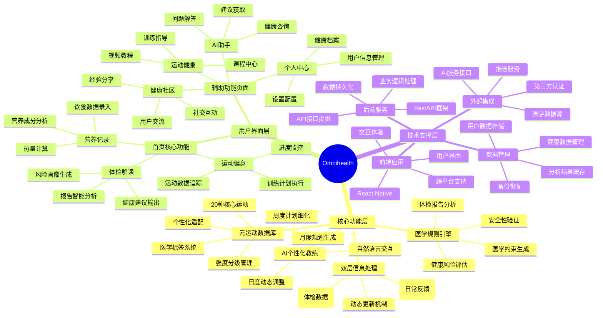

# 产品功能架构图

```mermaid
mindmap
  root((Omnihealth))
    核心功能层
      AI个性化教练
        月度规划生成
        周度计划细化
        日度动态调整
        自然语言交互
      医学规则引擎
        体检报告分析
        健康风险评估
        医学约束生成
        安全性验证
      元运动数据库
        20种核心运动
        医学标签系统
        强度分级管理
        个性化适配
      双层信息处理
        一级信息(体检数据)
        二级信息(日常反馈)
        动态更新机制
    用户界面层
      首页核心功能
        营养记录
          饮食数据录入
          营养成分分析
          热量计算
        运动健身
          运动数据追踪
          训练计划执行
          进度监控
        体检解读
          报告智能分析
          风险画像生成
          健康建议输出
      辅助功能页面
        运动健康
          课程中心
          训练指导
          视频教程
        健康社区
          用户交流
          经验分享
          社交互动
        AI助手
          健康咨询
          问题解答
          建议获取
        个人中心
          用户信息管理
          健康档案
          设置配置
    技术支撑层
      后端服务
        FastAPI框架
        数据持久化
        业务逻辑处理
        API接口提供
      前端应用
        React Native
        跨平台支持
        用户界面
        交互体验
      数据管理
        用户数据存储
        健康数据管理
        分析结果缓存
        备份恢复
      外部集成
        AI服务接口
        医学数据源
        第三方认证
        推送服务
```