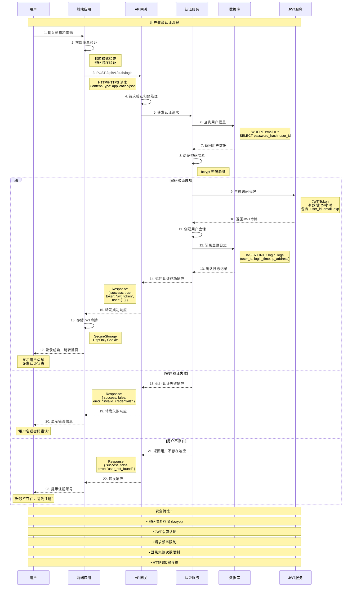

# 用户登录认证时序图

```mermaid
sequenceDiagram
    participant User as 用户
    participant Frontend as 前端应用
    participant API as API网关
    participant Auth as 认证服务
    participant DB as 数据库
    participant JWT as JWT服务

    Note over User,JWT: 用户登录认证流程

    %% 用户输入登录信息
    User->>Frontend: 1. 输入邮箱和密码
    Frontend->>Frontend: 2. 前端表单验证
    Note right of Frontend: 邮箱格式检查<br/>密码强度验证

    %% 发送登录请求
    Frontend->>API: 3. POST /api/v1/auth/login
    Note left of API: HTTP/HTTPS 请求<br/>Content-Type: application/json

    %% API网关处理
    API->>API: 4. 请求验证和预处理
    API->>Auth: 5. 转发认证请求

    %% 认证服务处理
    Auth->>DB: 6. 查询用户信息
    Note right of DB: WHERE email = ?<br/>SELECT password_hash, user_id

    DB-->>Auth: 7. 返回用户数据
    Auth->>Auth: 8. 验证密码哈希
    Note right of Auth: bcrypt 密码验证

    alt 密码验证成功
        Auth->>JWT: 9. 生成访问令牌
        Note right of JWT: JWT Token<br/>有效期: 24小时<br/>包含: user_id, email, exp

        JWT-->>Auth: 10. 返回JWT令牌
        Auth->>Auth: 11. 创建用户会话
        Auth->>DB: 12. 记录登录日志
        Note right of DB: INSERT INTO login_logs<br/>(user_id, login_time, ip_address)

        DB-->>Auth: 13. 确认日志记录
        Auth-->>API: 14. 返回认证成功响应
        Note left of API: Response:<br/>{ success: true,<br/>  token: "jwt_token",<br/>  user: {...} }

        API-->>Frontend: 15. 转发成功响应
        Frontend->>Frontend: 16. 存储JWT令牌
        Note right of Frontend: SecureStorage<br/>HttpOnly Cookie

        Frontend-->>User: 17. 登录成功，跳转首页
        Note over User: 显示用户信息<br/>设置认证状态

    else 密码验证失败
        Auth-->>API: 18. 返回认证失败响应
        Note left of API: Response:<br/>{ success: false,<br/>  error: "invalid_credentials" }

        API-->>Frontend: 19. 转发失败响应
        Frontend-->>User: 20. 显示错误信息
        Note over User: "用户名或密码错误"

    else 用户不存在
        Auth-->>API: 21. 返回用户不存在响应
        Note left of API: Response:<br/>{ success: false,<br/>  error: "user_not_found" }

        API-->>Frontend: 22. 转发响应
        Frontend-->>User: 23. 提示注册账号
        Note over User: "账号不存在，请先注册"

    end

    Note over User,JWT: 安全特性：
    Note over User,JWT: • 密码哈希存储 (bcrypt)
    Note over User,JWT: • JWT令牌认证
    Note over User,JWT: • 请求频率限制
    Note over User,JWT: • 登录失败次数限制
    Note over User,JWT: • HTTPS加密传输
```